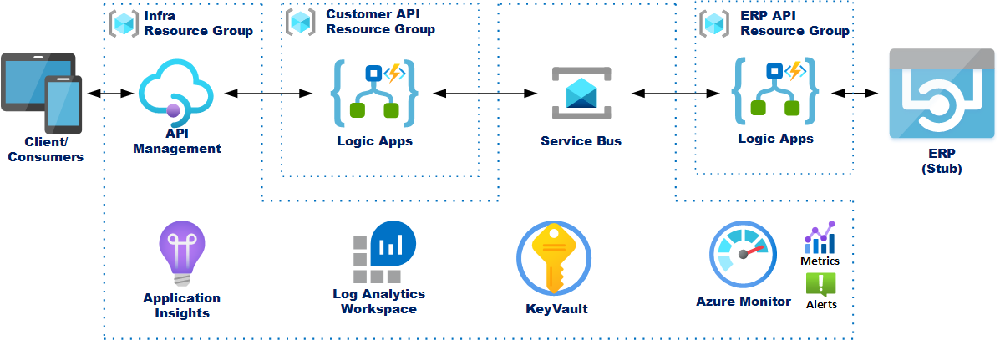

# AIS DevOps Example
This repository contains a simple DevOps example of a skeleton (or bare bones) Azure Integration Services (AIS) based solution with some sample quick start ARM templates and YAML pipelines to help you get the solution up and running in no time.

The deployment is fully automated and all you need to get started is an Azure account, a Azure DevOps Organization/Project and an user account (or service principle) that allows you to deploy to your Azure subscription.

> If you don't have an account already, you can create a free account [here](https://azure.microsoft.com/en-gb/free/)

## Solution Overview
Imagine a scenario where, as new customers are registered on the company website and/or mobile app, the details for these new customers need to be sent to a number of backend systems (For example the company CRM, ERP etc.). 

### Components
This example solution consists of some infrastructure, an "on-ramp" and an "off-ramp".

| Component | Description |
|-----------|-------------|
| **Infrastructure** | The backbone of the solution providing basic plumbing for the solution (api/messaging/logging/etc.) |
| **On-ramp** (or "**publisher**") | The API exposed to the website/mobile app that publishes new customers to the solution |
| **Off-ramp** (or "**subscriber**") | The interface(s) to backend system(s) (ERP system in this example). The off-ramp subscribes to published messages on behalf of the back end system and delivers the messages to that system in the format & transport required by the backend system  (for example: JSON HTTPS or SOAP/XML over net.tcp) |

This solution makes use of the following Azure Services:
* [**API Management**](https://docs.microsoft.com/en-us/azure/api-management/api-management-key-concepts) - used to expose the customer Web API
* [**Logic Apps**](https://docs.microsoft.com/en-us/azure/logic-apps/logic-apps-overview) - used for message processing** and publishing and subscribing to messages.
* [**Service Bus**](https://docs.microsoft.com/en-us/azure/service-bus-messaging/service-bus-messaging-overview) - messaging backbone of the solution. This example makes use of service bus topics and subscriptions.
* [**KeyVault**](https://docs.microsoft.com/en-us/azure/key-vault/key-vault-overview) - used to securely store secret details (such as credentials and connections strings, etc.) which the solution references.
* [**Azure Monitor**](https://docs.microsoft.com/en-us/azure/azure-monitor/overview)
    * [**Log Analytics Workspace**](https://docs.microsoft.com/en-us/azure/azure-monitor/log-query/log-query-overview) - used for logging and monitoring of the Logic Apps.
    * [**Application Insights**](https://docs.microsoft.com/en-us/azure/azure-monitor/app/app-insights-overview) - used for monitoring API Management.

> [**Azure Event Grid**](https://docs.microsoft.com/en-us/azure/event-grid/overview) is another key service makes up AIS suite of services but is not used in this quick start example as that would require Service Bus Premium Tier. Event Grid would provide an optimal solution as the "off-ramp" logic app wouldn't be required to poll for new messages and will instead be notified of new messages by Event Grid as they arrive on the Service Bus. _For this quick sample solution the subscribing Logic App will just poll the Service Bus for new messages every minute._

** **PLEASE NOTE:** The logic apps in this solution do **nothing**. They just pass-through any messages that they receive straight through to the backend system (or stub in this case). These logic apps don't do any processing (for validation, enrichment or transformation) of the messages. This example solution is more for demonstrating DevOps using YAML and ARM Templates and less about capabilities of AIS.

This example solution also includes a stub (or mock API) that to represents the backend EPR system to allow quick & easy testing. More off-ramps to backend systems can quickly and easily be added to the solution as required. A simple API with a mock response has been created in API Management for this.

### Naming convention:
This sample makes use of a specific convention for naming resources. All resources which are aware of (or make use of) other shared resources in the same solution expect those resources to named in a specific way. This just makes discovery of the components of the solution much easier and the simplifies and stream lines the parameter files for the various ARM templates.

> Formula: `<environment>-<project/client>-<resource/group description>-<region>`

| Item | Description |
|------|-------------|
| **environment** | A value that indicates the environment. For Example: "dev", "test", "uat" or "prod" |
| **project** | Name of the project or customer |
| **resource/group description** | For example: "sb" for service bus resource or "infra" for infrastructure resource group. |
| **region** | Short value of the region (or location) of where the resource is deployed to. For example "ne" for "north europe" |

## Want more great quick start templates?
If you would like to find some more great quick start templates (but with more features and best practices baked in) then please check out [**Invictus for Azure**](https://www.codit.eu/en/solutions/invictus-for-biztalk-and-azure-integration/)  

## Contributing
We are open for all contributions, learn more about contributing to this repo in the ["Contributions guide"](docs/CONTRIBUTING.md).
